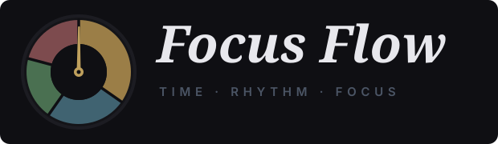

<p align="center">
  
</p>

<p align="center">
  <strong>Gestión modular de tiempo y secuencias de enfoque de alto rendimiento.</strong><br>
  Software de escritorio nativo, ligero y enfocado en la ejecución continua sin fricción ni recolección de datos.
</p>

<p align="center">
  
  
  
  
  
</p>

---

## Descripción General

**Focus Flow** es una aplicación de escritorio diseñada para estructurar sesiones de trabajo complejas mediante cadenas secuenciales de tiempo. Su propósito es optimizar la concentración reduciendo la carga cognitiva necesaria para planificar periodos de trabajo, pausas estratégicas y tiempos de recuperación.

Desarrollada sobre **Tauri v2** y **Rust**, la aplicación ofrece un consumo mínimo de memoria RAM, un ejecutable inferior a 2 MB y ejecución local sin dependencias de servicios externos.

---

## Módulos y Capacidades Técnicas

### 1. Motor de Secuencias Personalizadas
* **Estructuración por fases:** Permite componer rutinas integrando cuatro estados parametrizables: Enfoque, Descanso, Movimiento y Procrastinación deliberada.
* **Control de granularidad:** Definición de bloques con duraciones estrictas entre 1 y 60 minutos.
* **Muestreo visual inteligente:** La interfaz procesa secuencias extensas manteniendo una representación visual limpia mediante un algoritmo de muestreo proporcional de máximo 10 indicadores de estado.
* **Reorganización en caliente:** Capacidad de reordenar y editar la duración de los bloques directamente en la interfaz.

### 2. Modo Flotante Always-on-Top (Mini Widget)
* **Transición de ventana nativa:** Al inicializar un flujo, la aplicación reduce su dimensión a 300 × 170 px mediante comandos directos en Rust.
* **Prioridad en el gestor de ventanas:** Se ancla por encima de navegadores y entornos de desarrollo sin interrumpir el flujo visual de trabajo.
* **Visualización esencial:** Presenta únicamente el tiempo restante, la fase activa, el bloque subsiguiente y los controles de ciclo (pausa, reinicio, avance forzado).
* **Restauración automática:** Al finalizar el ciclo o cancelar la sesión, la ventana recupera sus dimensiones operativas estándar de manera fluida.

### 3. Cronómetro Libre y Registro en Tiempo Real
* Diseñado para sesiones de trabajo sin planificación previa.
* Permite alternar instantáneamente entre estados de actividad calculando en tiempo real el tiempo invertido en cada categoría.
* Gráfico de distribución de porcentaje en vivo para monitorear el balance de la sesión.

### 4. Métricas de Rendimiento y Calendario Histórico
* **Monitoreo de objetivos diarios:** Configuración de metas diarias de productividad (de 1 a 1440 minutos / 24 h).
* **Cálculo de efectividad:** Métrica porcentual que evalúa el cumplimiento frente a la meta diaria establecida.
* **Gráficos de distribución:** Desglose del tiempo invertido por día mediante barras de proporción exacta.
* **Bloqueo temporal lógico:** El calendario delimita el historial a partir de la fecha de instalación, garantizando consistencia en los datos.

### 5. Arquitectura de Privacidad y Rendimiento
* **Almacenamiento Local (Local-First):** Toda la persistencia opera de forma síncrona en el equipo del usuario. No se transmiten métricas, telemetría ni credenciales a servidores remotos.
* **Síntesis de Audio Web:** Alertas sonoras generadas en tiempo real mediante la Web Audio API, eliminando la sobrecarga de dependencias y archivos de audio pesados.

---

## Especificaciones del Stack

| Componente | Tecnología | Rol en el Sistema |
| :--- | :--- | :--- |
| **Backend / Núcleo** | Rust + Tauri v2 | Control de ventana nativo, tray del sistema y empaquetado optimizado |
| **Frontend** | TypeScript | Lógica de estado, temporización y renderizado modular |
| **Herramienta de Build**| Vite | Empaquetado y compilación del entorno web |
| **Estilos** | CSS3 (Container Queries) | Renderizado responsivo adaptativo al ancho de contenedores |
| **Persistencia** | Storage Engine Local | Manejo de estructuras de datos e historial de sesiones |

---

## 🚀 Instalación y Uso

### Opción 1: Descargar el Instalador (Recomendado para Usuarios)

1. Descarga el archivo ejecutable más reciente desde el directorio de lanzamientos:
   ```text
   focus-flow_0.1.0_x64-setup.exe
   ```
2. Ejecuta el archivo `.exe` y sigue el asistente de instalación.
3. ¡Listo! Focus Flow creará su acceso directo en tu Escritorio y Menú Inicio.

> **Nota:** Al tratarse de un ejecutable independiente sin certificado de firma comercial, Windows SmartScreen puede mostrar una pantalla preventiva. Haz clic en **"Más información"** $\rightarrow$ **"Ejecutar de todas formas"**.

---

### Opción 2: Compilar desde el Código Fuente

#### Prerrequisitos
- [Node.js](https://nodejs.org/) (versión 18 o superior)
- [Rust & Cargo](https://www.rust-lang.org/tools/install)
- Dependencias de compilación de C++ para Windows (Build Tools for Visual Studio)

#### Pasos

1. **Clonar el repositorio:**
   ```bash
   git clone [https://github.com/tu-usuario/focus-flow.git](https://github.com/tu-usuario/focus-flow.git)
   cd focus-flow
   ```

2. **Instalar dependencias de frontend:**
   ```bash
   npm install
   ```

3. **Ejecutar en modo desarrollo:**
   ```bash
   npm run tauri dev
   ```

4. **Compilar el instalador para producción (`.exe`):**
   ```bash
   npm run tauri build
   ```
   El instalador se generará en:
   ```text
   src-tauri/target/release/bundle/nsis/focus-flow_0.1.0_x64-setup.exe
   ```

---

## 📁 Estructura del Proyecto

```text
focus-flow/
├── assets/
│   └── logo.svg                 # Isotipo y logotipo oficial en formato vectorial
├── src/
│   ├── components/              # Sidebar, modales y componentes UI
│   ├── models/                  # Interfaces y modelos de TypeScript (Flow, Block, Tasks)
│   ├── services/                # Audio, Storage, Modal y puente nativo Tauri
│   ├── styles/                  # Hojas de estilo modulares (main, timer, editor, calendar)
│   ├── utils/                   # Catálogo de iconos SVG y formateadores de tiempo
│   ├── views/                   # Vistas principales (Home, FlowEditor, ActiveTimer, LiveTimer, Calendar)
│   └── app.ts                   # Enrutador y punto de entrada SPA
├── src-tauri/
│   ├── src/main.rs              # Lógica de ventana nativa, comandos y bandeja en Rust
│   ├── tauri.conf.json          # Configuración de empaquetado, permisos e iconos
│   └── Cargo.toml               # Dependencias del ecosistema Rust / Tauri
├── package.json
└── README.md
```

---

## 📄 Licencia

Este proyecto está bajo la Licencia **MIT**. Consulta el archivo `LICENSE` para más detalles.
